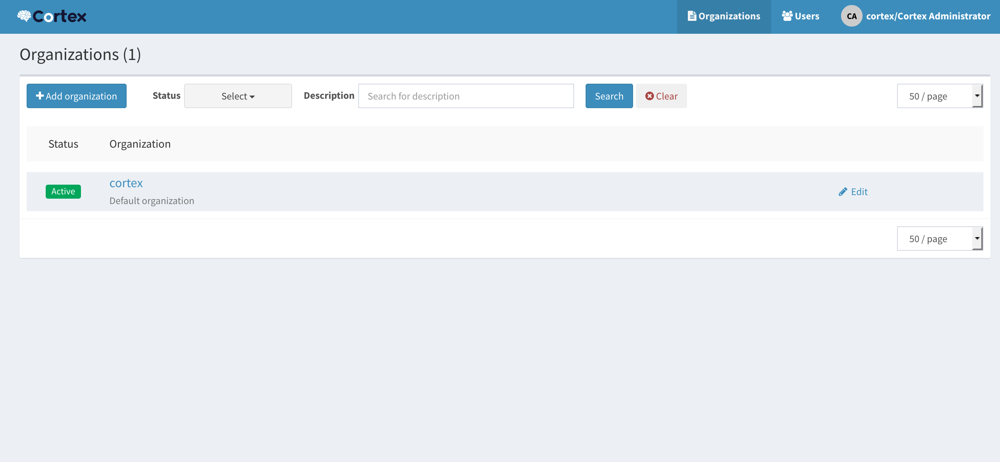
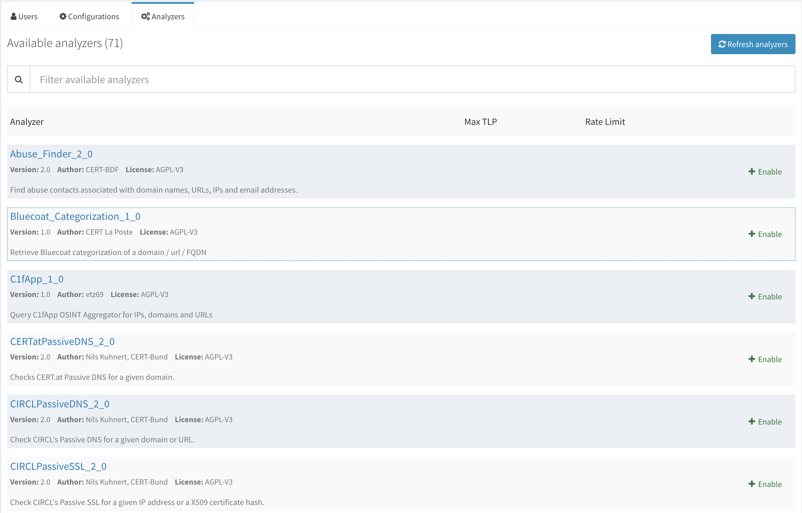

Quick start guide
-----------------

# Setup `/etc/cortex/application.conf`

The Cortex back-end configuration file sits in `/etc/cortex/application.conf` by default.

In order to start Cortex, the only required parameter is the key of the server
(`play.http.secret.key`). This key is used to authenticate the cookies that
contain data, and not only a session ID. If Cortex runs in cluster mode, all
instances must share the same key.

You should generate a random key using the following command line:

```
(cat << _EOF_
# Secret key
# ~~~~~
# The secret key is used to secure cryptographics functions.
# If you deploy your application to several instances be sure to use the same key!
play.http.secret.key="$(cat /dev/urandom | tr -dc 'a-zA-Z0-9' | fold -w 64 | head -n 1)"
_EOF_

search.host = ['127.0.0.1:9300']
analyzer.path = ['/opt/Cortex-Analyzers/analyzers']

) | sudo tee -a /etc/cortex/application.conf

```

Please, note that this secret key is mandatory to start the Cortex application.

After saving the file, restart the application (`service cortex restart` on Ubuntu). 


# "Update Database"

Cortex is now using ElasticSearch as database to store users, organizations and analyzers configuration.

First time you connect to the UI (`http://<CORTEX_IP>:9001` by default) you have to create the database clicking the "Update Database" button.


# Cortex administrator

You are then invited to create a first user. This is the Cortex global administration user. It will be able to create Organizations and users on the server.


You will then be able to log in using this user. A first `cortex` organization has been created and includes Cortex admininistrators.




# New Organization

Now, create your own organization inside Cortex by clicking the `Add organization`  button.


# New admin user for the New organization

And then, create the organization administrator account and make sure you create this user with `orgadmin` role.


Then, specify a password for this user, logout and login with that new user.


# Create an account for TheHive integration

To allow TheHive requesting for analysis, create a new account inside your organisation with the `read, analyze` role.


# Migration from Cortex 1.x

If you are migrating from Cortex 1.x, you have update Cortex configuration file and ensure the following information is set up (update values as needed): 

```
play.http.secret.key="..."
search.host = ['127.0.0.1:9300']
analyzer.path = ['/opt/Cortex-Analyzers/analyzers']
```

As there is no migration tool for analyzers configuration, as OrgAdmin, you need to enable and configure every analyzer in the UI.




